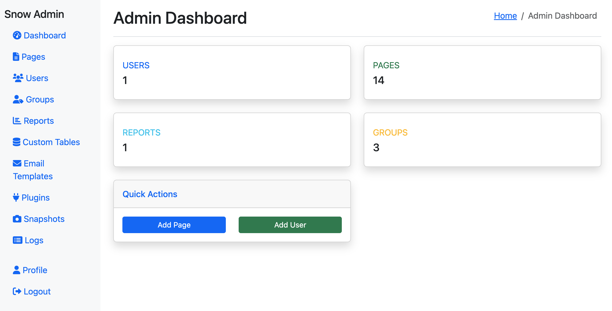

# Snow Framework

> **v1.0 MVP · 43 source files · ~7,400 lines of code · zero external dependencies**

A zero-dependency PHP admin framework for LAMP stacks. Any MySQL table — custom or built-in — gets ACL, versioning, CRUD, search/sort/filter, and reporting without writing boilerplate for each table.



## Features

### Security
- **CSRF Protection** — Per-session tokens enforced centrally; every POST form protected automatically
- **DB-Backed Sessions** — MySQL `SessionHandlerInterface` with `SELECT FOR UPDATE` locking; session fixation prevention
- **Password Policy** — Configurable minimum length, maximum age, and reuse control; expiry prompts at login
- **Two-Factor Authentication** — Email OTP (6-digit code) as a second factor; per-user opt-in via admin UI
- **Activity Logging** — Structured DB log + flat-file redundancy for logins, errors, and outbound emails

### Access Control
- **Group-Based ACL** — Users belong to any number of groups; managed from the user edit page
- **Row-Level View ACL** — `view_groups` field on every custom table; `NULL` = open to all data users
- **Row-Level Edit ACL** — `edit_groups` field separate from view; view-only mode enforced server-side
- **Permission Tiers** — `table_management` (schema + ACL) vs `table_data_access` (data only) keeps content editors separate from admins

### Data Management
- **Standard Columns** — Every provisioned custom table automatically gets `created_at`, `modified_at`, `status`, `view_groups`, `edit_groups`
- **Custom Fields** — Add fields to any custom table via admin UI; configure type, label, and width
- **Customizable Form Layout** — Per-field `col_width` (half/full) controls edit form layout per table
- **Search, Sort & Filter** — Full-text search, sortable column headers, and advanced filter panel on every list view — no per-table code required
- **Scheduled Lifecycle** — Set `activate_at`, `deactivate_at`, or `delete_at` on any row; status changes automatically on schedule

### Versioning & Snapshots
- **Row Version History** — Every edit records a JSON before-image with user and timestamp
- **One-Click Rollback** — Restore any row to any prior version; current state preserved as a new version entry
- **Table Snapshots** — Full-table copy via `CREATE TABLE AS SELECT`; named and timestamped
- **Diff View** — Row-level diff showing added, removed, and changed rows since any snapshot
- **Snapshot Restore** — Atomic `RENAME TABLE` sequence with pre-restore auto-snapshot safety net; schema-drift warning on confirmation

### Extensibility
- **PHP Hook System** — Register hook files that execute automatically on `before_create`, `after_create`, `before_update`, `after_update` for any table; errors silently logged
- **Custom Web Pages** — Create pages with a URL path and PHP/HTML content served directly by the framework
- **Email Templates** — Named templates with `{{variable}}` substitution; call by name with variable values

### Admin
- **Admin Interface** — Self-generating admin pages for all built-in and custom tables
- **Report System** — File-based reports (`reports/*.php`) with HTML and CSV output
- **Plugin System** — Import/export plugins for site customization
- **Session Viewer** — View all active sessions and force-logout any session
- **Password Policy Config** — Configure policy from admin UI; takes effect immediately

## Requirements

- Linux Server (Ubuntu 24+ recommended)
- Apache2 Web Server
- PHP 8.4+
- MySQL 8.0+
- `mod_rewrite` enabled

## Installation

### 1. Clone the Repository

```bash
git clone git@github.com:wcharliebrown/Snow.git /var/www/html/snow
cd /var/www/html/snow
```

### 2. Set Permissions

```bash
sudo chown -R www-data:www-data .
sudo chmod -R 755 .
sudo chmod -R 770 logs keys
```

### 3. Configure Environment

Copy `.env.example` to `.env` and edit:

```bash
cp .env.example .env
```

```bash
# Database
DB_HOST=localhost
DB_NAME=snow
DB_USER=your_db_user
DB_PASS=your_secure_password

# Site
SITE_NAME=Your Website
SITE_URL=https://yourdomain.com
ADMIN_EMAIL=admin@yourdomain.com

# Security
SESSION_TIMEOUT=3600
PASSWORD_MIN_LENGTH=8
ENCRYPTION_KEY=your_32_character_encryption_key_here
```

### 4. Create Database

```sql
CREATE DATABASE snow CHARACTER SET utf8mb4 COLLATE utf8mb4_unicode_ci;
CREATE USER 'snow_user'@'localhost' IDENTIFIED BY 'your_password';
GRANT ALL PRIVILEGES ON snow.* TO 'snow_user'@'localhost';
FLUSH PRIVILEGES;
```

### 5. Import Schema

```bash
mysql -u snow_user -p snow < database_schema.sql
```

### 6. Configure Apache

```apache
<VirtualHost *:80>
    ServerName yourdomain.com
    DocumentRoot /var/www/html/snow/public_html

    <Directory /var/www/html/snow/public_html>
        AllowOverride All
        Require all granted
    </Directory>

    ErrorLog ${APACHE_LOG_DIR}/snow_error.log
    CustomLog ${APACHE_LOG_DIR}/snow_access.log combined
</VirtualHost>
```

```bash
sudo a2ensite yourdomain.com.conf
sudo a2enmod rewrite
sudo systemctl restart apache2
```

### Default Login

- **Email**: admin@example.com
- **Password**: admin123

**Change the default password immediately after first login.**

## Directory Structure

```
snow/
├── .env                        # Configuration (copy from .env.example)
├── database_schema.sql         # Full schema including all v1.0 tables
├── public_html/                # Web root
│   ├── index.php               # Main bootstrap
│   └── .htaccess               # Apache rewrite rules
├── functions/                  # One function per PHP file
│   ├── acl.php                 # Row-level ACL (canViewRow, canEditRow, filterRowsByViewAccess)
│   ├── auth.php                # Authentication (loginUser, logoutUser, hasPermission)
│   ├── csrf.php                # CSRF token generation and validation
│   ├── session-handler.php     # SnowSessionHandler (DB-backed sessions)
│   ├── password-policy.php     # Policy functions (check, enforce, changePassword)
│   ├── logging.php             # Structured activity logging
│   ├── database.php            # DB helpers (dbQuery, dbGetRow, dbInsert, etc.)
│   ├── email.php               # Email sending + sendEmailTemplate()
│   ├── encryption.php          # Field-level encryption
│   ├── pages.php               # Page rendering + CSRF enforcement
│   ├── reports.php             # Report rendering
│   └── template.php            # Token-based template system
├── reports/                    # Report files (*.php)
├── logs/                       # Activity and error logs
└── keys/                       # Encryption keys
```

## Core API

### Authentication & Sessions
```php
loginUser($email, $password)             // Authenticate; forks to 2FA if require_2fa set
logoutUser()                             // End session
hasPermission($permission)               // Check current user's permission
requireLogin()                           // Redirect to login if not authenticated
requirePermission($permission)           // Redirect if permission missing
```

### ACL
```php
canViewRow($row, $userGroups)            // Check row view_groups against user's groups
canEditRow($row, $userGroups)            // Check row edit_groups against user's groups
filterRowsByViewAccess($rows, $groups)   // Filter a result set to visible rows only
```

### Database
```php
dbQuery($sql, $params)                   // Execute query
dbGetRow($sql, $params)                  // Fetch single row
dbGetRows($sql, $params)                 // Fetch multiple rows
dbInsert($table, $data)                  // Insert record
dbUpdate($table, $data, $where, $params) // Update record
dbDelete($table, $where, $params)        // Delete record
```

### Pages & Templates
```php
renderPage($path)                        // Render page (enforces CSRF on POST)
processTokens($content, $data)           // Replace {{tokens}} in content
renderTemplate($templateFile, $data)     // Render a template file
```

### Email
```php
sendEmailTemplate($name, $to, $data)     // Send named template with {{variable}} substitution
sendEmail($to, $subject, $body)          // Send email directly
```

### Logging
```php
logError($message)                       // Log error (DB + flat file)
logMessage($level, $category, $msg)      // Structured log entry
```

### Encryption
```php
encryptString($data, $keyName)           // Encrypt field value
decryptString($encrypted, $keyName)      // Decrypt field value
```

## Template Tokens

```html
{{title}}                                    <!-- Variable -->
{{user.first_name}}                          <!-- Object property -->
{{#if user.is_admin}}...{{/if}}              <!-- Conditional -->
{{#each items}}{{title}}{{/each}}            <!-- Loop -->
{{user_list_report}}                         <!-- Embedded report -->
```

## Custom Tables

Create and manage custom tables from the admin UI:

1. **Provision** — Admin creates table; standard columns (`created_at`, `modified_at`, `status`, `view_groups`, `edit_groups`, schedule columns) added automatically
2. **Fields** — Add custom fields with type, label, and column width
3. **ACL** — Set view/edit group restrictions per row
4. **Hooks** — Register PHP files to fire on `before_create`, `after_create`, `before_update`, `after_update`
5. **Search** — Full-text search, sortable headers, and advanced filters available immediately
6. **History** — Every edit recorded; rollback to any prior version with one click
7. **Snapshots** — Create named snapshots, diff against live data, restore atomically

## License

Provided as-is for educational and development purposes. Review and customize before production use.
